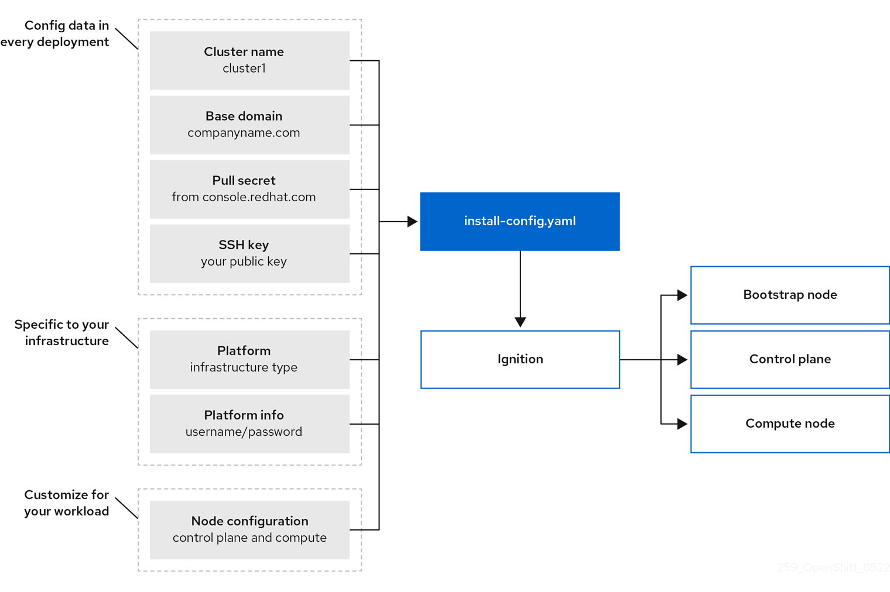

Let's start with an overview of the disconnected installation process.

## Creating an Air Gap
According to the [Internet Security Glossary](https://www.rfc-editor.org/rfc/rfc4949), an Air Gap is an interface between two systems at which (a) they are not connected physically and (b) any logical connection is not automated (i.e., data is transferred through the interface only manually, under human control). In disconnected installations, the air gap exists between the Low Side and the High Side, so it is between these systems where a manual data transfer, or **sneakernet** is required.

## Preparing the Low Side
A disconnected installation begins with downloading content and tooling to a **prep system** that has outbound access to the Internet. This server resides in an environment commonly referred to as the **Low Side** due to its low security profile. Compliance requirements usually prevent the low side from housing sensitive data or private information.

## Preparing the High Side
We then provision a **bastion server** which has no Internet access and resides in an environment commonly referred to as the **High Side** due to its high security profile. It is in the high side where sensitive data and production systems (like the cluster we're about to provision) live. During this phase, we'll need to transfer the content and tooling from the low side to the high side, a process which may entail use of a VPN or physical media like a DVD or USB. Once our transfer is complete, we'll need to start a **mirror registry** on the bastion server which will supply the container images needed for our OpenShift installation, since our installer can't reach out to quay.io or registry.redhat.io directly from here.

## Preparing the Installation
The OpenShift installation process is initiated from the bastion server. There are a handful of different ways to install OpenShift, but for this lab we're going to be using installer-provisioned infrastructure (IPI). By default, the installation program acts as an installation wizard, prompting you for values that it cannot determine on its own and providing reasonable default values for the remaining parameters. We'll then need to customize the `install-config.yaml` file that is produced to specify advanced configuration for our disconnected installation. The installation program then provisions the underlying infrastructure for the cluster. Here's a diagram describing the inputs and outputs of the installation configuration process:

IPI is the recommended installation method because it leverages full automation in installation and cluster management, but there are some key considerations to keep in mind when planning a production installation in a real world scenario.
* **You may not have access to the infrastructure APIs.** Our lab is going to live in AWS, which requires connectivity to the `.amazonaws.com` domain. We accomplish this by using an *allowed list* on a Squid proxy running on the high side, but a similar approach may not be achievable or permissible for everyone. We'll discuss this further later in the lab.
* **You may not have sufficient permissions with your infrastructure provider**. Our lab has full admin in our AWS enclave, so that's not a constraint we'll need to deal with. In real world environments, you'll need to ensure your account has the [appropriate permissions](https://docs.openshift.com/container-platform/4.13/installing/installing_aws/installing-aws-account.html#installation-aws-permissions_installing-aws-account) which sometimes involves negotiating with security teams.

Once configuration has been completed, we can kick off the OpenShift Installer and it will do all the work for us to provision the infrastructure and install OpenShift.

## Accessing the Cluster
Since the cluster we'll produce is in a disconnected environment, it won't be publicly accessible via the Internet. In many cases, cluster access is restricted to hosts within the high side themselves. In our lab, we'll use the bastion server as a **jumphost** so that we can access the cluster from our laptop.

## Planning Ahead
Once the cluster is up, what comes next? This lab ends when the cluster is installed, but there are many more considerations to made for how you manage things like upgrades, operators, patches, and more. 