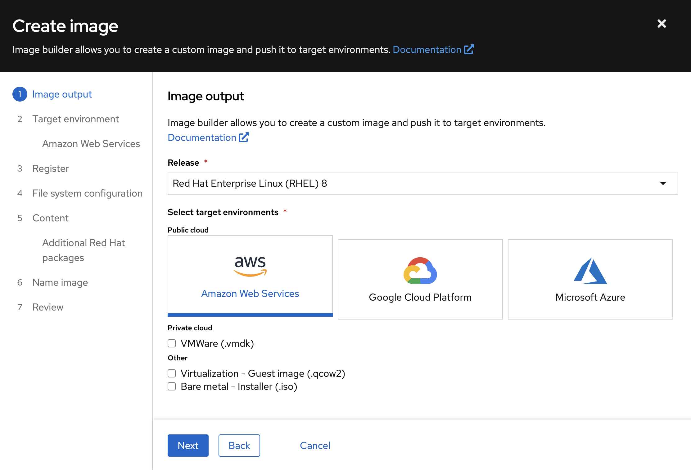
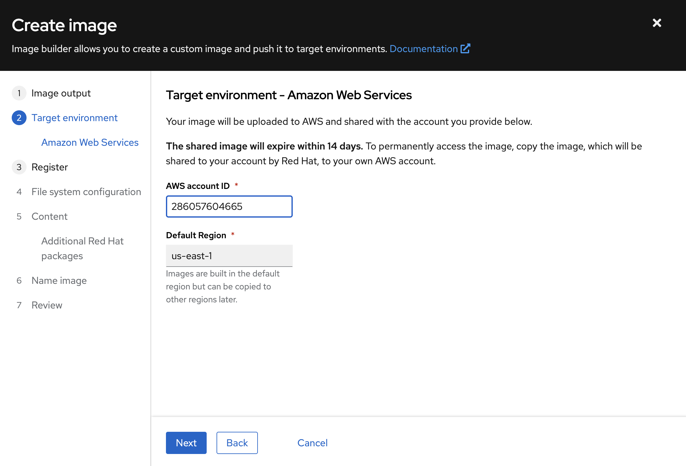
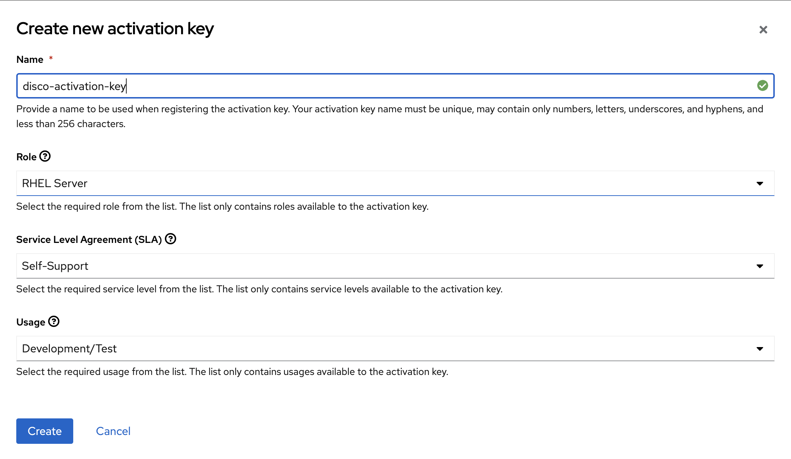
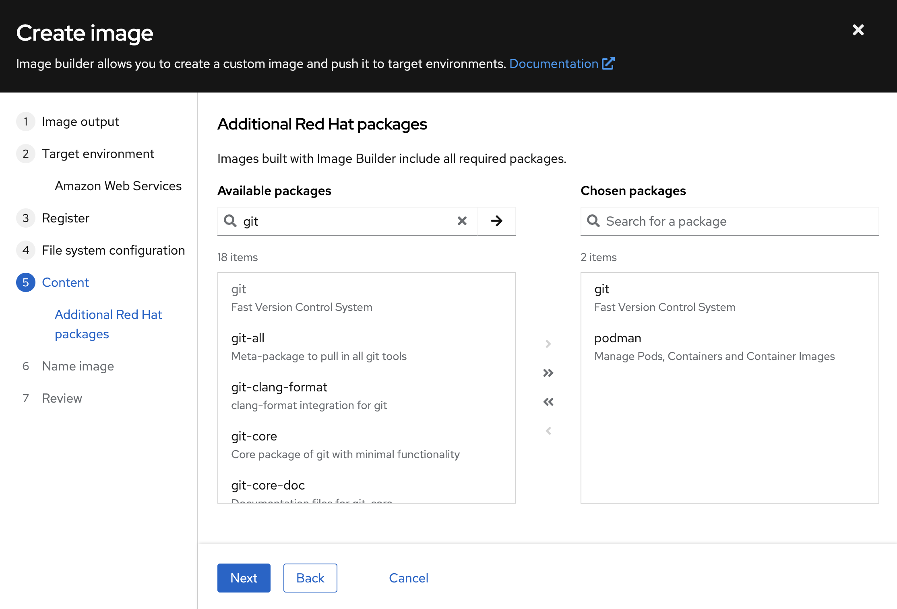

In this lab, we'll prepare the High Side. Recall from our architecture diagram that our bastion server on the high side will host our mirror registry. To do this we're interested in using `podman`, since it simplifies operation of the registry to run it within a container. 

However, we have a dilemma: the AMI we used for the prep system does not have `podman` installed! We could rectify this by running `sudo dnf install -y podman` on the prep system, but the bastion server won't have Internet access, so we need another option. Unfortunately, `podman` cannot be sneakernetted into the bastion server as we're doing with other tools, because the installation is quite complex (`dnf` obscures this complexity).

To solve this problem, we need to *build our own RHEL image* with `podman` pre-installed. One such approach is to use the **Image Builder** in the Hybrid Cloud Console, and that's exactly what we'll do.

## Using Image Builder
Image Builder, bundled with Red Hat Insights, enables you to create customized images and upload them to a variety of cloud environments, such as Amazon Web Services, Microsoft Azure and Google Cloud Platform. You also have the option to download the images you create for on-prem infrastructure environments. Let's get started:

1. Visit the Image Builder service in the [Hybrid Cloud Console](https://console.redhat.com/insights/image-builder) and click **Create Image**.
2. Let's use the Red Hat Enterprise Linux (RHEL) 8 Release, and AWS for the target environment. Then click **Next**. 
   
3. Grab your AWS account ID from your workstation by running:
   ```execute
   aws sts get-caller-identity --query "Account" --output text
   ```
   > You can also get this from the web console using the URL provided in your email from RHDP.
   Specify this in the **AWS account ID** and click **Next**. Image Builder will push the image to a Red Hat-owned AWS account and share it with the account ID you specify.
   
4. Leave the default Registration method selected. If you already have an Activation Key available to use, click **Next** and skip to Step 5. Otherwise, let's go create one in [Remote Host Configuration](https://console.redhat.com/settings/connector/activation-keys)
   * Click **Create activation key**, make the following selections and click **Create**:
      
5. Leave the default File system configuration and click **Next**
6. Here's our opportunity to add some packages to the VM: let's search for `podman`, and `git` in case we need it later. Then click **Next**.
   
   > Use the right arrow in the middle of the pane to populate the Chosen packages section.
7. Give your image a sweet name, like **AWS Disco Bastion Image** and click **Next**
8. Click **Create Image** on the next screen, and sit back and relax as your image is built.

## Mirroring Images
Images used by operators and platform components must be mirrored from upstream sources into a container registry that is accessible by the high side. You can use any registry you like for this as long as it supports Docker v2-2, such as:
* Red Hat Quay
* JFrog Artifactory
* Sonatype Nexus Repository
* Harbor

An OpenShift subscription includes access to the [mirror registry for Red Hat OpenShift](https://docs.openshift.com/container-platform/4.13/installing/disconnected_install/installing-mirroring-creating-registry.html#installing-mirroring-creating-registry), which is a small-scale container registry designed specifically for mirroring images in disconnected installations. We'll make use of this option in this lab.

### Creating a Mirror Host
We're going to start by creating a host to house our registry. According to the [documentation](https://docs.openshift.com/container-platform/latest/installing/disconnected_install/installing-mirroring-creating-registry.html#prerequisites_installing-mirroring-creating-registry), our host must have the following characteristics:
* Red Hat Enterprise Linux (RHEL) 8 and 9 with Podman 3.4.2 or later and OpenSSL installed.
* 2 vCPUs
* 8 GB RAM
* About 12 GB for OpenShift Container Platform 4.13 release images, or about 358 GB for OpenShift Container Platform 4.13 release images and OpenShift Container Platform 4.13 Red Hat Operator images. Up to 1 TB per stream or more is suggested.

> Note that storage requirements are relatively modest for a bare-bones install, but a more future-proof setup has greater capacity to accommodate mirroring update streams when it comes time to upgrade the cluster.

Mirroring all release and operator images can take awhile depending on the network bandwidth. For this lab, we're going to mirror  just the release images to save time and resources.

```bash
# TODO - create ec2 or have this pre-configured
```

### Creating a Mirror Registry
Next we're going to deploy the registry itself. First, ssh into your bastion host and 

### Mirroring Content